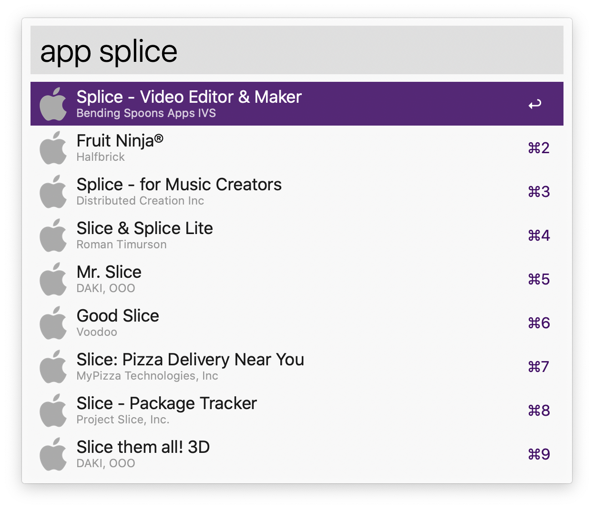

App Store Finder for [Alfred](http://www.alfredapp.com)
==============================

Find any app in the App Store and paste its app ID.

### Commands
* `app <app name> [<storefront>]`
* `app <app ID>`

### Examples
* `app 30 day fitness it`
* `app pic jointer`
* `app sleep`
* `app stepz gb`
* `app 409838725`
* `app 1148951074`

You can specify a storefront to find the app name in that specific storefront. Please notice that the apps are _not_ ordered according to the App Store search results.

**[Last release](https://github.com/pinuz95/alfred-app-store-finder/releases)**

